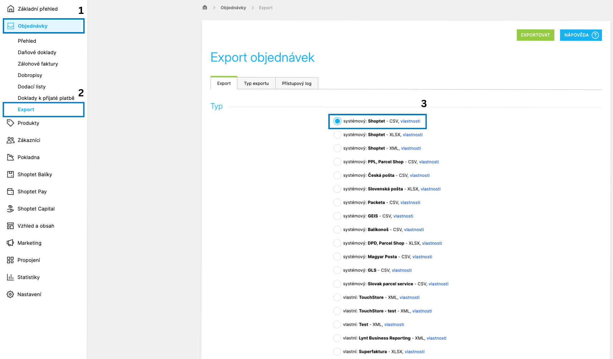
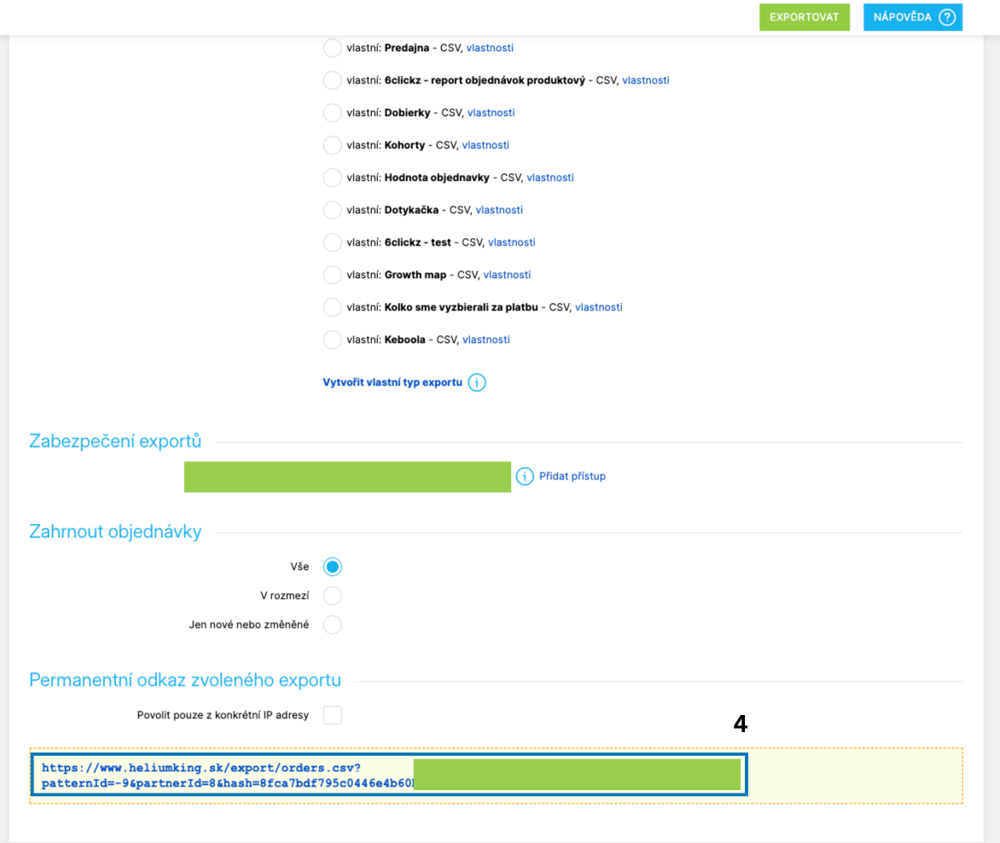

# Marketing Dashboard Template

## Popis

Tento repozitář obsahuje návod k propojení dat ze Shoptetu do šablony v Keboola a následnému zobrazení v marketingovém dashboardu.

## Rychlý start

1. V Shoptetu otevřete Objednávky → Export a zvolte „Shoptet – CSV“, poté zkopírujte exportní URL.
2. V Keboole v sekci Templates vyberte šablonu „Marketing dashboard“.
3. Přihlaste se do Google Analytics a Facebook Ads (Meta Ads).
4. Vložte Shoptet exportní URL a URL vašeho obchodu, potvrďte vytvoření.

## Předpoklady

- Přístup do administrace Shoptet
- Přístup do Google Analytics a Facebook Ads (Meta Ads)

## Shoptet: získání exportní URL

1. Přihlaste se do administrace Shoptet.
2. V levém menu otevřete Objednávky → Export.
3. V části Systémové zvolte Shoptet – CSV.

4. Přejděte na konec stránky a zkopírujte vygenerovanou URL adresu exportu.

## Keboola: nasazení šablony

1. V Keboole přejděte do sekce Templates a vyberte příslušnou šablonu. (Marketing dashboard)
2. Při vyplňování parametrů se přihlaste do svého účtu Google Analytics a Facebook Ads.
3. Vložte zkopírovanou Shoptet URL a URL vašeho obchodu.
4. Potvrďte vytvoření a vyčkejte na dokončení zpracování.

## Poznámky

- Snímek pro kroky 1–3: 1.png
- Pokud používáte jiné názvy či cesty, upravte je v tomto README.

## Kontrola výsledku

Po spuštění šablony v Keboole:

- Zkontrolujte, že poslední běh (Run) proběhl úspěšně.
- Ověřte, že se data z Shoptetu načetla (např. počet objednávek za posledních 7 dní).
- Otevřete marketingový dashboard a ověřte načtení metrik.

## Odkazy

- Dokumentace Shoptet – export objednávek: [shoptet.cz – nápověda](https://www.shoptet.cz/napoveda/)  
- Keboola – Templates: [keboola.com](https://www.keboola.com)

## Řešení problémů

- Exportní URL vrací 403/404: ověřte přihlášení a práva v Shoptetu, případně vygenerujte novou URL.
- Prázdný CSV export: zkontrolujte filtr období a stav objednávek.
- Chybí oprávnění v GA/Meta: požádejte administrátora o roli s přístupem ke čtení.
