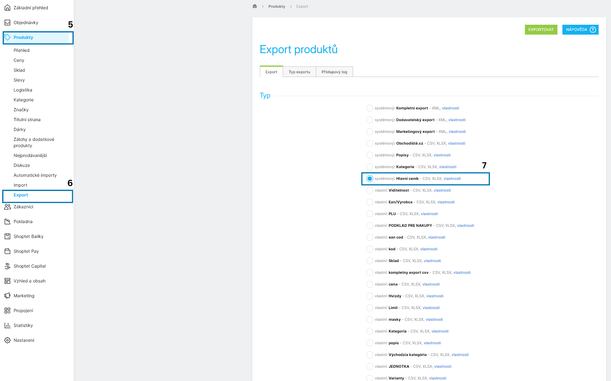
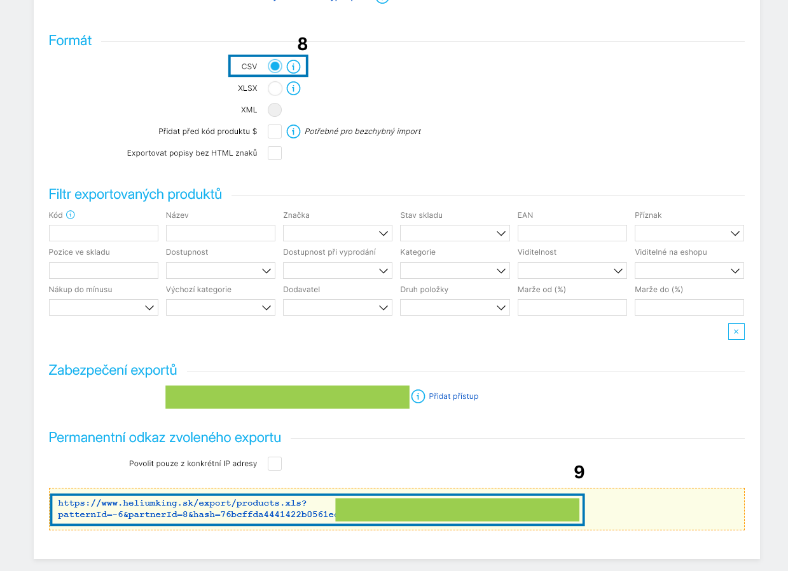

# Shoptet Ads & Sales Dashboard

## Popis

Tento repozitář obsahuje návod k propojení dat ze Shoptetu do šablony v Keboola a k následnému zobrazení v dashboardu „Shoptet Ads & Sales Dashboard“.

- Zdroj aplikace/dashboards: `app.py` (hlavní soubor s logikou a UI)

## Předpoklady

- Přístup do administrace Shoptet
- Přístup do Google Analytics a Facebook Ads (Meta Ads)

## Shoptet: získání exportní URL
Přihlaste se do administrace Shoptet.
1. V levém menu otevřete Objednávky.
2. Klikněte na Export.
3. V seznamu vyberte Systémové → Shoptet – CSV.

4. Na konci stránky zkopírujte vygenerovanou URL exportu.

5. V levém menu otevřete Produkty.
6. Klikněte na Export.
7. V seznamu vyberte Systémové → Hlavní ceník.
8. Zvolte formát CSV.

9. Zkopírujte URL exportu.

## Keboola: nasazení šablony

Video průvodce: TBD

1. V Keboole přejděte do sekce Templates a vyberte šablonu „Shoptet Ads & Sales Dashboard“.
2. Při vyplňování parametrů se přihlaste do svého účtu Google Analytics a Facebook Ads.
3. Vložte zkopírované Shoptet URL a URL vašeho obchodu.
4. Potvrďte vytvoření a vyčkejte na dokončení zpracování.

## Poznámky

- Snímek pro kroky 1–3: 1.png
- Pokud používáte jiné názvy či cesty, upravte je v tomto README.

## Kontrola výsledku

Po spuštění šablony v Keboole:

- Zkontrolujte, že poslední běh (Run) proběhl úspěšně.
- Ověřte, že se data z Shoptetu načetla (např. počet objednávek za posledních 7 dní).
- Otevřete marketingový dashboard a ověřte načtení metrik.

## Řešení problémů

- Exportní URL vrací 403/404: ověřte přihlášení a práva v Shoptetu, případně vygenerujte novou URL.
- Prázdný CSV export: zkontrolujte filtr období a stav objednávek.
- Chybí oprávnění v GA/Meta: požádejte administrátora o roli s přístupem ke čtení.
